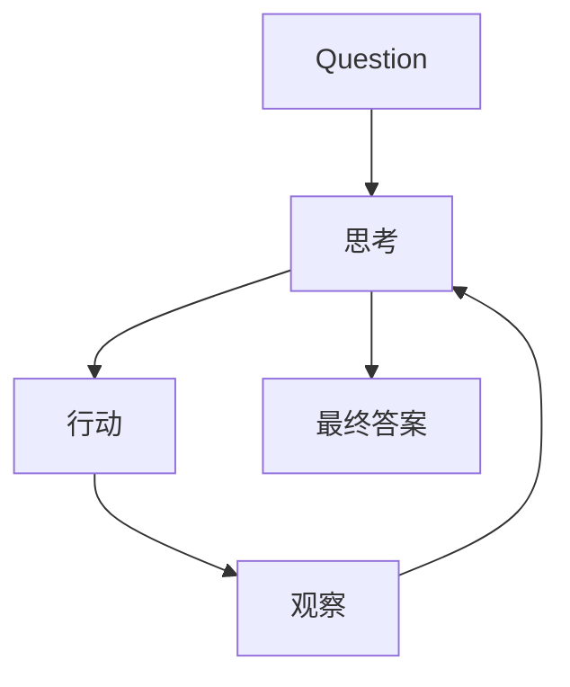

# React

```python
尽你所能用中文回答以下问题，如果能力不够你可以使用以下工具：
{tools}
===
Use the following format:
- Question: the input question you must answer
- Thought: you should always think about what to do
- Action: the action to take, should be one of [{tool_names}]
- Action Input: the input to the action
- Observation: the result of the action
...(this Thought/ Action/ Action Input/ Observation can repeat `N` times)

Thought: I now know the final answer
Final Answer: the final answer to the original input question

===
Now, begin
Question: {input}
Thought: {agent_scratchpad}
```



## Code

```python
from dotenv import load_dotenv
load_dotenv("./.env")
from loguru import logger
from langchain.prompts import PromptTemplate
from langchain_openai import ChatOpenAI
from langchain.agents import load_tools, AgentExecutor, create_react_agent

llm = ChatOpenAI(model="gpt-4o", temperature=.5)
tools = load_tools(["serpapi", "llm-math"], llm=llm)
logger.info(f"load tools: \n{tools}")


template = """
尽你所能用中文回答以下问题，如果能力不够你可以使用以下工具：
{tools}
===
Use the following format:
- Question: the input question you must answer
- Thought: you should always think about what to do
- Action: the action to take, should be one of [{tool_names}]
- Action Input: the input to the action
- Observation: the result of the action
...(this Thought/ Action/ Action Input/ Observation can repeat `N` times)

Thought: I now know the final answer
Final Answer: the final answer to the original input question

===
Now, begin
Question: {input}
Thought: {agent_scratchpad}
"""

prompt = PromptTemplate.from_template(template)
agent = create_react_agent(llm, tools, prompt)
agent_executor = AgentExecutor(
    agent=agent, tools=tools, handle_parsing_errors=True, verbose=True)

agent_executor.invoke(
    {"input":"目前市场上玫瑰花的一般进货价格是多少？如果我在此基础上加价5%，应该如何定价？"})

# langsmith log: https://smith.langchain.com/public/0b52070d-4cb8-4ffe-a0b6-64e35670fefc/r

```

## Log

### Round 1

input

```log
尽你所能用中文回答以下问题，如果能力不够你可以使用以下工具：
Search(query: str, **kwargs: Any) -> str - A search engine. Useful for when you need to answer questions about current events. Input should be a search query.
Calculator(*args: Any, callbacks: Union[List[langchain_core.callbacks.base.BaseCallbackHandler], langchain_core.callbacks.base.BaseCallbackManager, NoneType] = None, tags: Optional[List[str]] = None, metadata: Optional[Dict[str, Any]] = None, **kwargs: Any) -> Any - Useful for when you need to answer questions about math.

===
Use the following format:
- Question: the input question you must answer
- Thought: you should always think about what to do
- Action: the action to take, should be one of [Search, Calculator]
- Action Input: the input to the action
- Observation: the result of the action
...(this Thought/ Action/ Action Input/ Observation can repeat `N` times)

Thought: I now know the final answer
Final Answer: the final answer to the original input question

===
Now, begin
Question: 目前市场上玫瑰花的一般进货价格是多少？如果我在此基础上加价5%，应该如何定价？
Thought: 
```

```log
目前市场上玫瑰花的进货价格可能会因地区、季节和供应情况而有所不同。为了给出准确的答案，我需要查找当前市场上玫瑰花的一般进货价格。

Action: Search
Action Input: "目前市场上玫瑰花的进货价格 2023"
```

### Round 2

```log

尽你所能用中文回答以下问题，如果能力不够你可以使用以下工具：
Search(query: str, **kwargs: Any) -> str - A search engine. Useful for when you need to answer questions about current events. Input should be a search query.
Calculator(*args: Any, callbacks: Union[List[langchain_core.callbacks.base.BaseCallbackHandler], langchain_core.callbacks.base.BaseCallbackManager, NoneType] = None, tags: Optional[List[str]] = None, metadata: Optional[Dict[str, Any]] = None, **kwargs: Any) -> Any - Useful for when you need to answer questions about math.

===
Use the following format:
- Question: the input question you must answer
- Thought: you should always think about what to do
- Action: the action to take, should be one of [Search, Calculator]
- Action Input: the input to the action
- Observation: the result of the action
...(this Thought/ Action/ Action Input/ Observation can repeat `N` times)

Thought: I now know the final answer
Final Answer: the final answer to the original input question

===
Now, begin
Question: 目前市场上玫瑰花的一般进货价格是多少？如果我在此基础上加价5%，应该如何定价？
Thought: 目前市场上玫瑰花的进货价格可能会因地区、季节和供应情况而有所不同。为了给出准确的答案，我需要查找当前市场上玫瑰花的一般进货价格。

Action: Search
Action Input: "目前市场上玫瑰花的进货价格 2023"

Observation: ['近日，中证君走访了上海的鲜花批发市场及街边花店发现，鲜花需求价量齐升。其中，以“爱”为名的玫瑰价格创新高。 “今年的玫瑰进价尤其贵，相较去年基本上翻 ...', '价格走低带来的是成交量的显著上升，近期温州水果市场内，阳光玫瑰葡萄也成为热门成交果品。 在广州，目前市场上阳光玫瑰的零售价为每斤10多元到30多元不等。“阳光玫瑰分为几个 ...', '批发市场价格上涨，鲜花零售门店价格更为高昂。位于朝阳大悦城的一家花店工作人员向北京商报记者介绍道，“之前一枝玫瑰(不分品种)的价格是25元，现在已经涨到了35元，而且消费者大多是提前一到两天预订，情人节当天制作和配送时效性不能保证”。', '... 价通常会上涨1/4，玫瑰、康乃馨等必备款的加价率更高。”经过产地、交易市场、批发商等的层层流转后，鲜切花的价格也相应地一轮轮上涨。 除了直接到产地采购进货外，有的花店会以本地花卉批发市场为主要进货渠道。魅花透露，有时候，盒马鲜生销售的一些基础类鲜花，售价比批发市场的还低，“所以，业内不少花店也会去盒马进花。', '... 鲜花种得少，开年之后鲜花的需求一上涨，价格自然就被炒起来了。”王女士表示，最近鲜花的进货价都在翻倍上涨，再加上运输折损，每支玫瑰成本都在10元以上，过几天可能还会涨。 鲜花批发价的飙升，也让王女士略感头疼：定价定贵了怕没人愿意买，折在手里；定低了又赔本赚吆喝，得不偿失。不过高价鲜花并没有减轻大家订购鲜花 ...', '“每天供货的量一般有一、两千枝，多的时候会有四、五千枝。现在临近年关，进货的客户多了，量也开始大了。”肖江平介绍说，基地上种植了50亩鲜切玫瑰花，共有卡布奇诺、洛神、芭比等五个品种，目前均已进入采收期，经过包装后主要销往斗南花市。', '在北方的郑州花卉市场，去年最低40元一扎（20枝）的玫瑰，今年最高已涨至160元。 有商户预判，往年同期，99朵玫瑰的批发价可能只有四五百元，零售价可以达到七八百元 ...', '这几天，玫瑰花自然成了首选。记者走访嘉定的鲜花批发市场和花店了解到，玫瑰的价格一路看涨。花店零售价20元一支的红玫瑰，你会买吗？ 在曹安公路上的一家花店里，店家正忙着包装预定的花束。店主介绍，一周前，情人节的订单就开始预约了，但今年的价格涨幅惊人。以往300多元的玫瑰花束，现在涨价到了500元。', '近日，澎湃新闻（www.thepaper.cn）记者走访上海的鲜花批发市场以及零售店铺发现，鲜花市场回暖，需求量增大，价格普遍看涨。玫瑰花的价格预计还会涨一波，一些高品质的玫瑰甚至供不应求。 有花店老板表示，情人节过后玫瑰 ...', '近日，中证君走访了上海的鲜花批发市场及街边花店发现，鲜花需求价量齐升。其中，以“爱”为名的玫瑰价格创新高。 “今年的玫瑰进价尤其贵，相较去年基本上翻了3倍。”有批发市场店主对中证君说。']
Thought: 
```

```log
通过搜索结果可以看出，玫瑰花的进货价格在不同地区和时间有较大波动。以下是一些关键点：

1. 玫瑰花的价格在不同地区和时间波动较大。
2. 在一些地区，玫瑰花的进货价格已经翻了3倍。
3. 每支玫瑰的成本在10元以上，甚至更高。

为了给出一个大致的定价，我们可以假设玫瑰花的平均进货价格为10元每支。

接下来，我们需要计算在此基础上加价5%的定价。

Thought: 需要使用计算器来计算加价5%后的价格。
Action: Calculator
Action Input: 10 * 1.05
```

### Round 3


````log
Translate a math problem into a expression that can be executed using Python's numexpr library. Use the output of running this code to answer the question.

Question: ${Question with math problem.}
```text
${single line mathematical expression that solves the problem}
```
...numexpr.evaluate(text)...
```output
${Output of running the code}
```
Answer: ${Answer}

Begin.

Question: What is 37593 * 67?
```text
37593 * 67
```
...numexpr.evaluate("37593 * 67")...
```output
2518731
```
Answer: 2518731

Question: 37593^(1/5)
```text
37593**(1/5)
```
...numexpr.evaluate("37593**(1/5)")...
```output
8.222831614237718
```
Answer: 8.222831614237718

Question: 10 * 1.05
````


````log
```text
10 * 1.05
```
...numexpr.evaluate("10 * 1.05")...

````

### Round 4

```log

尽你所能用中文回答以下问题，如果能力不够你可以使用以下工具：
Search(query: str, **kwargs: Any) -> str - A search engine. Useful for when you need to answer questions about current events. Input should be a search query.
Calculator(*args: Any, callbacks: Union[List[langchain_core.callbacks.base.BaseCallbackHandler], langchain_core.callbacks.base.BaseCallbackManager, NoneType] = None, tags: Optional[List[str]] = None, metadata: Optional[Dict[str, Any]] = None, **kwargs: Any) -> Any - Useful for when you need to answer questions about math.

===
Use the following format:
- Question: the input question you must answer
- Thought: you should always think about what to do
- Action: the action to take, should be one of [Search, Calculator]
- Action Input: the input to the action
- Observation: the result of the action
...(this Thought/ Action/ Action Input/ Observation can repeat `N` times)

Thought: I now know the final answer
Final Answer: the final answer to the original input question

===
Now, begin
Question: 目前市场上玫瑰花的一般进货价格是多少？如果我在此基础上加价5%，应该如何定价？
Thought: 目前市场上玫瑰花的进货价格可能会因地区、季节和供应情况而有所不同。为了给出准确的答案，我需要查找当前市场上玫瑰花的一般进货价格。

Action: Search
Action Input: "目前市场上玫瑰花的进货价格 2023"

Observation: ['近日，中证君走访了上海的鲜花批发市场及街边花店发现，鲜花需求价量齐升。其中，以“爱”为名的玫瑰价格创新高。 “今年的玫瑰进价尤其贵，相较去年基本上翻 ...', '价格走低带来的是成交量的显著上升，近期温州水果市场内，阳光玫瑰葡萄也成为热门成交果品。 在广州，目前市场上阳光玫瑰的零售价为每斤10多元到30多元不等。“阳光玫瑰分为几个 ...', '批发市场价格上涨，鲜花零售门店价格更为高昂。位于朝阳大悦城的一家花店工作人员向北京商报记者介绍道，“之前一枝玫瑰(不分品种)的价格是25元，现在已经涨到了35元，而且消费者大多是提前一到两天预订，情人节当天制作和配送时效性不能保证”。', '... 价通常会上涨1/4，玫瑰、康乃馨等必备款的加价率更高。”经过产地、交易市场、批发商等的层层流转后，鲜切花的价格也相应地一轮轮上涨。 除了直接到产地采购进货外，有的花店会以本地花卉批发市场为主要进货渠道。魅花透露，有时候，盒马鲜生销售的一些基础类鲜花，售价比批发市场的还低，“所以，业内不少花店也会去盒马进花。', '... 鲜花种得少，开年之后鲜花的需求一上涨，价格自然就被炒起来了。”王女士表示，最近鲜花的进货价都在翻倍上涨，再加上运输折损，每支玫瑰成本都在10元以上，过几天可能还会涨。 鲜花批发价的飙升，也让王女士略感头疼：定价定贵了怕没人愿意买，折在手里；定低了又赔本赚吆喝，得不偿失。不过高价鲜花并没有减轻大家订购鲜花 ...', '“每天供货的量一般有一、两千枝，多的时候会有四、五千枝。现在临近年关，进货的客户多了，量也开始大了。”肖江平介绍说，基地上种植了50亩鲜切玫瑰花，共有卡布奇诺、洛神、芭比等五个品种，目前均已进入采收期，经过包装后主要销往斗南花市。', '在北方的郑州花卉市场，去年最低40元一扎（20枝）的玫瑰，今年最高已涨至160元。 有商户预判，往年同期，99朵玫瑰的批发价可能只有四五百元，零售价可以达到七八百元 ...', '这几天，玫瑰花自然成了首选。记者走访嘉定的鲜花批发市场和花店了解到，玫瑰的价格一路看涨。花店零售价20元一支的红玫瑰，你会买吗？ 在曹安公路上的一家花店里，店家正忙着包装预定的花束。店主介绍，一周前，情人节的订单就开始预约了，但今年的价格涨幅惊人。以往300多元的玫瑰花束，现在涨价到了500元。', '近日，澎湃新闻（www.thepaper.cn）记者走访上海的鲜花批发市场以及零售店铺发现，鲜花市场回暖，需求量增大，价格普遍看涨。玫瑰花的价格预计还会涨一波，一些高品质的玫瑰甚至供不应求。 有花店老板表示，情人节过后玫瑰 ...', '近日，中证君走访了上海的鲜花批发市场及街边花店发现，鲜花需求价量齐升。其中，以“爱”为名的玫瑰价格创新高。 “今年的玫瑰进价尤其贵，相较去年基本上翻了3倍。”有批发市场店主对中证君说。']
Thought: 通过搜索结果可以看出，玫瑰花的进货价格在不同地区和时间有较大波动。以下是一些关键点：

1. 玫瑰花的价格在不同地区和时间波动较大。
2. 在一些地区，玫瑰花的进货价格已经翻了3倍。
3. 每支玫瑰的成本在10元以上，甚至更高。

为了给出一个大致的定价，我们可以假设玫瑰花的平均进货价格为10元每支。

接下来，我们需要计算在此基础上加价5%的定价。

Thought: 需要使用计算器来计算加价5%后的价格。
Action: Calculator
Action Input: 10 * 1.05
Observation: Answer: 10.5
Thought: 

```

```log
我现在已经知道答案了。

Final Answer: 如果玫瑰花的进货价格为10元每支，在此基础上加价5%后的定价应该是10.5元每支。
```
