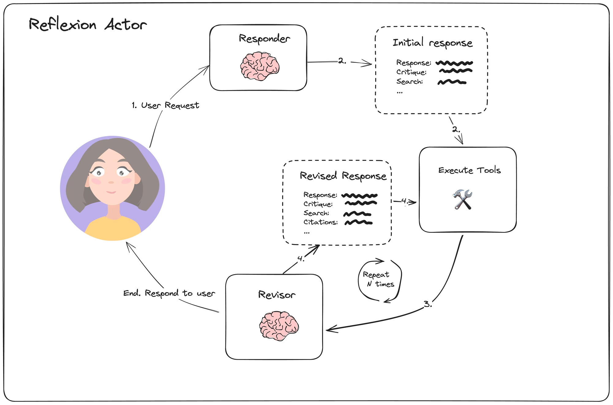

# Reflexion



## langgraph

:rocket: [langsmith tutorial](https://smith.langchain.com/public/71c9bc9e-8d53-4314-a530-8593e99135ee/r)


### Logs

```log
2024-08-06 23:53:40.953 | DEBUG    | __main__:<module>:36 - 
================================== Ai Message ==================================
Tool Calls:
  AnswerQuestion (call_YkJE4aSQaJKJSQVbAOF81CtR)
 Call ID: call_YkJE4aSQaJKJSQVbAOF81CtR
  Args:
    answer: Reflection is a crucial aspect in the development and functioning of Artificial Intelligence (AI) systems. It enables AI to self-assess, learn from past experiences, and improve its performance over time. Reflection in AI involves the system evaluating its decisions, outcomes, and processes, and then using this evaluation to inform future actions. This process is akin to human reflective thinking, which is essential for learning and adaptation. For instance, when an AI system makes a prediction or an error, reflection allows it to analyze why the prediction was correct or why the error occurred. This analysis can lead to adjustments in algorithms, data inputs, or other parameters, thereby enhancing the system’s accuracy and reliability. Moreover, reflection aids in identifying biases and ethical considerations, ensuring that AI operates within acceptable moral frameworks. This self-improvement capability is particularly important in dynamic environments where conditions and data can change rapidly. By continuously reflecting on its performance, an AI can adapt to new situations more effectively, providing more robust and trustworthy outputs. In essence, reflection transforms AI from a static tool into a dynamic, evolving entity capable of continuous learning and improvement.
    reflection: {'missing': 'The answer could benefit from specific examples of AI systems where reflection has been successfully implemented. Additionally, it lacks a discussion on the technical mechanisms that enable reflection in AI, such as feedback loops and reinforcement learning.', 'superfluous': 'The mention of ethical considerations, while relevant, could be more concise. The focus should be on the technical and functional benefits of reflection in AI.', 'search_queries': ['examples of AI systems using reflection', 'technical mechanisms for reflection in AI', 'importance of feedback loops in AI']}
2024-08-06 23:53:40.976 | INFO     | __main__:<module>:3 - args keys: ['answer', 'reflection']
2024-08-06 23:53:40.979 | INFO     | __main__:<module>:5 - reflection keys: ['missing', 'superfluous', 'search_queries']
2024-08-06 23:55:14.021 | DEBUG    | __main__:<module>:18 - 
================================== Ai Message ==================================
Tool Calls:
  ReviseAnswer (call_SCkRz2xRgkNlpQWRir5YWhh0)
 Call ID: call_SCkRz2xRgkNlpQWRir5YWhh0
  Args:
    answer: Reflection is a crucial aspect in the development and functioning of Artificial Intelligence (AI) systems. It enables AI to self-assess, learn from past experiences, and improve its performance over time. Reflection in AI involves the system evaluating its decisions, outcomes, and processes, and then using this evaluation to inform future actions. This process is akin to human reflective thinking, which is essential for learning and adaptation. For instance, when an AI system makes a prediction or an error, reflection allows it to analyze why the prediction was correct or why the error occurred. This analysis can lead to adjustments in algorithms, data inputs, or other parameters, thereby enhancing the system’s accuracy and reliability. Moreover, reflection aids in identifying biases and ethical considerations, ensuring that AI operates within acceptable moral frameworks. This self-improvement capability is particularly important in dynamic environments where conditions and data can change rapidly. By continuously reflecting on its performance, an AI can adapt to new situations more effectively, providing more robust and trustworthy outputs. In essence, reflection transforms AI from a static tool into a dynamic, evolving entity capable of continuous learning and improvement.
    reflection: {'missing': 'The answer could benefit from specific examples of AI systems where reflection has been successfully implemented. Additionally, it lacks a discussion on the technical mechanisms that enable reflection in AI, such as feedback loops and reinforcement learning.', 'superfluous': 'The mention of ethical considerations, while relevant, could be more concise. The focus should be on the technical and functional benefits of reflection in AI.', 'search_queries': ['examples of AI systems using reflection', 'technical mechanisms for reflection in AI', 'importance of feedback loops in AI']}
    references: ['https://misq.umn.edu/how-ai-based-systems-can-induce-reflections-the-case-of-ai-augmented-diagnostic-work.html', 'https://www.unite.ai/ais-inner-dialogue-how-self-reflection-enhances-chatbots-and-virtual-assistants/', 'https://aisel.aisnet.org/misq/vol47/iss4/5/', 'https://www.deeplearning.ai/the-batch/agentic-design-patterns-part-2-reflection/', 'https://blog.langchain.dev/reflection-agents/']
2024-08-07 00:01:28.482 | INFO     | __main__:<module>:7 - Step 0
2024-08-07 00:01:28.485 | DEBUG    | __main__:<module>:8 - ================================ Human Message =================================

How should we handle the climate crisis?
2024-08-07 00:01:40.871 | INFO     | __main__:<module>:7 - Step 1
2024-08-07 00:01:40.873 | DEBUG    | __main__:<module>:8 - ================================== Ai Message ==================================
Tool Calls:
  AnswerQuestion (call_DEeYJqhtaA1GiPWYrbpNMQiJ)
 Call ID: call_DEeYJqhtaA1GiPWYrbpNMQiJ
  Args:
    answer: Handling the climate crisis requires a multifaceted approach that involves governments, businesses, and individuals. First and foremost, governments need to implement stringent policies to reduce greenhouse gas emissions. This can be achieved through legislation that promotes renewable energy sources such as wind, solar, and hydroelectric power while phasing out reliance on fossil fuels. Carbon pricing mechanisms, such as carbon taxes or cap-and-trade systems, can also be effective in incentivizing reductions in emissions.

Businesses play a crucial role, too. Corporate sustainability initiatives can significantly reduce industrial emissions. Companies should invest in green technologies, improve energy efficiency, and adopt sustainable supply chain practices. Transparent reporting of environmental impact and setting science-based targets are essential for accountability.

Individuals also have a part to play. Reducing personal carbon footprints through lifestyle changes such as using public transportation, reducing meat consumption, and conserving energy at home can collectively make a substantial difference. Public awareness and education campaigns can help foster a culture of sustainability.

International cooperation is essential, as the climate crisis is a global issue. Countries must work together to meet international agreements like the Paris Accord. Financial and technical support should be provided to developing nations to help them transition to greener economies.

Climate resilience and adaptation strategies are also necessary to cope with the changes that are already happening. Investing in infrastructure to protect against extreme weather events, preserving natural ecosystems, and developing sustainable agricultural practices are crucial steps.

In summary, a comprehensive and collaborative effort across all sectors of society is necessary to effectively tackle the climate crisis.
    reflection: {'missing': 'The answer could benefit from specific examples of successful policies or initiatives that have worked in different countries or sectors. It also lacks a discussion on the role of innovation and technology in addressing the climate crisis. Additionally, there is no mention of the financial mechanisms needed to support these initiatives, nor the role of education and research institutions in driving change.', 'superfluous': 'The general call for international cooperation and individual actions, while important, could be condensed to allow for more specific examples and detailed suggestions.', 'search_queries': ['successful climate policies examples', 'role of innovation and technology in climate crisis', 'financial mechanisms to support climate action', 'role of education in climate change mitigation']}
2024-08-07 00:03:49.744 | INFO     | __main__:<module>:7 - Step 0
2024-08-07 00:03:49.745 | DEBUG    | __main__:<module>:8 - 
================================ Human Message =================================

How should we handle the climate crisis?
2024-08-07 00:04:06.389 | INFO     | __main__:<module>:7 - Step 1
2024-08-07 00:04:06.390 | DEBUG    | __main__:<module>:8 - 
================================== Ai Message ==================================
Tool Calls:
  AnswerQuestion (call_BEMdqxRLZxTcnEtR0S2VvcWh)
 Call ID: call_BEMdqxRLZxTcnEtR0S2VvcWh
  Args:
    answer: Handling the climate crisis requires a multi-faceted approach that involves governments, businesses, and individuals. Firstly, governments need to implement and enforce stringent environmental regulations, such as carbon pricing, emissions trading schemes, and subsidies for renewable energy sources. International cooperation is crucial, as climate change is a global issue and requires coordinated efforts through treaties like the Paris Agreement. Businesses also play a significant role and should adopt sustainable practices, invest in green technologies, and reduce their carbon footprints. Corporate social responsibility and environmental, social, and governance (ESG) criteria should be integral to business operations. On an individual level, people can contribute by reducing energy consumption, using public transportation, recycling, supporting sustainable products, and advocating for environmental policies. Public awareness and education about the impacts of climate change and ways to mitigate it are vital. Additionally, investment in research and development for new technologies, such as carbon capture and storage, can provide long-term solutions. Natural solutions, such as reforestation and protecting biodiversity, are equally important as they enhance the planet's capacity to absorb carbon dioxide. Overall, a combination of policy, innovation, and behavioral change is essential to effectively tackle the climate crisis.
    reflection: {'missing': 'The answer could benefit from more specific examples of successful policies or initiatives that have been implemented in various countries or by businesses. Additionally, more emphasis on the social and economic impacts of climate change and the importance of just transition strategies for affected communities would provide a more comprehensive view.', 'superfluous': 'While the content is generally relevant, the mention of specific treaties like the Paris Agreement might be too detailed for an overview and could be replaced with a broader reference to international cooperation.', 'search_queries': ['successful climate policies around the world', 'impact of corporate sustainability on climate change', 'social and economic impacts of climate change', 'just transition strategies for climate change']}
2024-08-07 00:05:58.153 | INFO     | __main__:<module>:7 - Step 0
2024-08-07 00:05:58.156 | DEBUG    | __main__:<module>:8 - 
================================ Human Message =================================

How should we handle the climate crisis?
2024-08-07 00:06:08.059 | INFO     | __main__:<module>:7 - Step 1
2024-08-07 00:06:08.061 | DEBUG    | __main__:<module>:8 - 
================================== Ai Message ==================================
Tool Calls:
  AnswerQuestion (call_IAVBRAddiTB8WpyS2EmXL8Sk)
 Call ID: call_IAVBRAddiTB8WpyS2EmXL8Sk
  Args:
    answer: Addressing the climate crisis requires a multi-faceted approach involving governments, businesses, and individuals. One significant step is transitioning to renewable energy sources such as wind, solar, and hydro to reduce greenhouse gas emissions. Governments need to implement policies that incentivize the reduction of carbon footprints, including carbon taxes and subsidies for green technologies. International cooperation is crucial, as climate change is a global issue. Agreements like the Paris Accord aim to unify countries in their efforts to limit global temperature rise.

Businesses play a critical role by adopting sustainable practices. This includes reducing waste, improving energy efficiency, and investing in sustainable supply chains. Companies should also be transparent about their environmental impact and work towards achieving net-zero emissions.

Individuals can contribute by making eco-friendly choices such as reducing energy consumption, using public transportation, recycling, and supporting sustainable products and companies. Education and raising awareness about climate change are essential to drive collective action.

Additionally, investment in research and development is vital to advancing green technologies and finding innovative solutions to mitigate climate impacts. Protecting and restoring natural ecosystems like forests and wetlands can also help absorb CO2 and preserve biodiversity.

Ultimately, addressing the climate crisis requires coordinated efforts across all sectors of society, strong policy frameworks, technological innovation, and a commitment to sustainable living.
    reflection: {'missing': 'The initial response covers a broad range of actions but lacks specific examples of successful policies or initiatives. More detail on international cooperation mechanisms and local community actions would enhance the answer. Additionally, it does not address potential economic impacts and how to manage them.', 'superfluous': 'The mention of public transportation and recycling, while important, could be condensed to make room for more detailed discussion on other critical aspects like economic transitions and international frameworks.', 'search_queries': ['successful climate policies examples', 'impact of the Paris Accord on climate action', 'economic impacts of transitioning to renewable energy']}
2024-08-07 00:09:25.381 | INFO     | __main__:<module>:7 - Step 0
2024-08-07 00:09:25.382 | DEBUG    | __main__:<module>:8 - 
================================ Human Message =================================

How should we handle the climate crisis?
2024-08-07 00:09:50.106 | INFO     | __main__:<module>:7 - Step 1
2024-08-07 00:09:50.107 | DEBUG    | __main__:<module>:8 - 
================================== Ai Message ==================================
Tool Calls:
  AnswerQuestion (call_vu970ctZz0YtxQ7iEZpccGVg)
 Call ID: call_vu970ctZz0YtxQ7iEZpccGVg
  Args:
    answer: Handling the climate crisis requires a multifaceted approach involving governments, businesses, and individuals. The first step is acknowledging the severity of the crisis and the urgency of taking action. Governments should implement and enforce policies that reduce greenhouse gas emissions, such as carbon pricing, subsidies for renewable energy, and stricter regulations on pollution. International cooperation is crucial, as climate change is a global issue that transcends borders. Agreements like the Paris Accord need to be strengthened and adhered to rigorously.

Businesses have a significant role to play as well. They should adopt sustainable practices, invest in green technologies, and work towards carbon neutrality. Corporate social responsibility should include environmental stewardship, and companies should be transparent about their carbon footprint and mitigation efforts.

Individuals can contribute by making lifestyle changes that reduce their carbon footprint, such as using public transport, reducing meat consumption, conserving energy, and supporting sustainable products and companies. Education and awareness campaigns can help shift public attitudes and behaviors towards more sustainable practices.

Additionally, investing in research and development of new technologies to combat climate change, such as carbon capture and storage, renewable energy innovations, and sustainable agriculture practices, is essential. Finally, protecting and restoring natural ecosystems, which act as carbon sinks, can help mitigate the effects of climate change.
    reflection: {'missing': 'The answer could benefit from specific examples or case studies to illustrate successful strategies. Also, the role of education and grassroots movements could be expanded upon.', 'superfluous': 'The mention of the Paris Accord, while relevant, may not need as much emphasis in a general strategy outline. The focus should be more on actionable steps rather than specific treaties.', 'search_queries': ['successful climate change policies examples', 'role of education in combating climate change', 'corporate strategies for sustainability']}
2024-08-07 00:11:12.491 | INFO     | __main__:<module>:7 - Step 0
2024-08-07 00:11:12.492 | DEBUG    | __main__:<module>:8 - 
================================ Human Message =================================

How should we handle the climate crisis?
2024-08-07 00:12:21.999 | INFO     | __main__:<module>:214 - Step 0
2024-08-07 00:12:22.001 | DEBUG    | __main__:<module>:215 - 
================================ Human Message =================================

How should we handle the climate crisis?
2024-08-07 00:12:53.522 | INFO     | __main__:<module>:214 - Step 1
2024-08-07 00:12:53.524 | DEBUG    | __main__:<module>:215 - 
================================== Ai Message ==================================
Tool Calls:
  AnswerQuestion (call_vpV454PRH0Rwow4mMNbTnJYp)
 Call ID: call_vpV454PRH0Rwow4mMNbTnJYp
  Args:
    answer: Handling the climate crisis requires a multifaceted approach that combines immediate action with long-term strategies. Firstly, reducing greenhouse gas emissions is imperative. This can be achieved by transitioning to renewable energy sources like solar, wind, and hydropower, and by increasing energy efficiency in buildings, transportation, and industries. Governments need to implement policies such as carbon pricing, subsidies for clean energy, and regulations that limit emissions.

Secondly, we must invest in climate adaptation measures to protect communities from the impacts of climate change, such as rising sea levels, extreme weather events, and changing agricultural conditions. This includes building resilient infrastructure, improving disaster response systems, and developing sustainable agricultural practices.

Thirdly, preserving and restoring natural ecosystems, such as forests, wetlands, and oceans, is crucial as they act as carbon sinks and help mitigate climate change. Reforestation, afforestation, and preventing deforestation are key actions in this area.

Public awareness and education are also vital. People must understand the urgency of the crisis and be encouraged to adopt sustainable practices in their daily lives. This can be supported through educational programs, media campaigns, and community initiatives.

Lastly, international collaboration is essential. Climate change is a global issue that requires cooperation across borders. Countries need to work together to share technology, knowledge, and resources, and to fulfill international agreements like the Paris Agreement.

Addressing the climate crisis is complex and requires concerted efforts from governments, businesses, and individuals worldwide. Immediate action, combined with sustained commitment, can help mitigate the worst impacts of climate change and build a more sustainable future.
    reflection: {'missing': 'The answer could benefit from more specific examples and recent data to provide a clearer picture of current efforts and challenges. Additionally, it lacks discussion on the role of innovation and technology, as well as the importance of political will and economic considerations in driving climate action.', 'superfluous': 'The general suggestions on public awareness and international collaboration, while important, could be condensed to make room for more detailed and specific actionable items. Some redundancy in explaining the transition to renewable energy and energy efficiency might also be trimmed.', 'search_queries': ['current strategies and policies for reducing greenhouse gas emissions 2024', 'latest advancements in climate adaptation technologies', 'role of innovation and technology in combating climate change', 'economic impacts of climate change mitigation strategies', 'recent examples of successful international climate collaboration']}
2024-08-07 00:14:46.549 | INFO     | __main__:<module>:230 - Step 0
2024-08-07 00:14:46.552 | DEBUG    | __main__:<module>:231 - 
================================ Human Message =================================

How should we handle the climate crisis?
2024-08-07 00:20:01.165 | INFO     | __main__:<module>:230 - Step 0
2024-08-07 00:20:01.167 | DEBUG    | __main__:<module>:231 - 
================================ Human Message =================================

How should we handle the climate crisis?
2024-08-07 00:20:18.110 | INFO     | __main__:<module>:230 - Step 1
2024-08-07 00:20:18.111 | DEBUG    | __main__:<module>:231 - 
================================== Ai Message ==================================
Tool Calls:
  AnswerQuestion (call_NMeCo6oajfBSlK02ivQFzBz3)
 Call ID: call_NMeCo6oajfBSlK02ivQFzBz3
  Args:
    answer: Handling the climate crisis requires a multifaceted approach that involves international cooperation, technological innovation, policy reform, and individual action. Firstly, international cooperation is crucial, as climate change does not respect national borders. Agreements like the Paris Agreement are essential in setting global targets to reduce greenhouse gas emissions. Secondly, technological innovation in renewable energy sources, carbon capture and storage, and energy efficiency can significantly reduce our reliance on fossil fuels. Investment in research and development in these areas is essential. Thirdly, policy reform at both national and international levels is needed to support sustainable practices. This includes policies that incentivize renewable energy use, regulate emissions, and promote energy efficiency. Finally, individual action plays a role. This includes reducing energy consumption, supporting sustainable products and companies, and advocating for climate policies. Education and awareness campaigns are also important to change public behavior towards more sustainable practices. Collectively, these strategies can help mitigate the effects of climate change and transition towards a more sustainable future.
    reflection: {'missing': 'The answer could benefit from more specific examples of successful policy reforms, technological innovations, and international agreements. It also lacks a mention of adaptation strategies, which are equally important in handling the climate crisis.', 'superfluous': 'The mention of individual actions, while important, might be seen as less critical compared to the larger scale actions needed from governments and industries. This could potentially distract from the main focus on systemic change.'}
    search_queries: ['successful climate policy reforms', 'latest technological innovations in renewable energy', 'climate change adaptation strategies']
2024-08-07 00:20:22.012 | INFO     | __main__:<module>:230 - Step 2
2024-08-07 00:20:22.014 | DEBUG    | __main__:<module>:231 - 
================================= Tool Message =================================
Name: AnswerQuestion

[[{"url": "https://www.bu.edu/gdp/2023/03/24/world-bank-evolution-as-if-development-and-climate-change-really-mattered-four-foundations-for-successful-reform/", "content": "These development experts, largely from the Global South, believe the key to MDB reform is linking climate and development together. The brief outlines those beliefs and the foundations for making it a reality. Read the Policy Brief World Bank Evolution as if Development and Climate Change Really Mattered: Four Foundations for Successful Reform"}, {"url": "https://www.nytimes.com/interactive/2022/08/02/climate/manchin-deal-emissions-cuts.html", "content": "tax credits\nEnergy and Climate\nConsumer\nincentives\n+$124 billion\nClean electricity\n\u2013$37 b\n\u2013$39 billion\n\u2013$161 billion\n15 percent corporate\nminimum tax\n+$222 billion\nClean fuel and\nvehicle tax credits\n\u2013$36 billion\nConservation,\nforestry, rural\ndevelopment\nOther\nclimate\nand energy\nspending\nExcise tax on\ncorporate\nstock buybacks\nActive loss\nlimitation\n+$54 b\n\u2013$35 billion\n+$74 billion\n\u2013$35 billion\nBuilding efficiency\nAir pollution mitigation\n\u2013$20 billion\n\u2013$28 billion\nHealth Care\nMedicaid drug\nbenefits and other\nspending\nExtension of expanded ACA subsidies\nfor 3 years\n\u2013$64 billion\n+$7 billion\nOther\n\u2013$34 billion\nPrescription Drug\nPricing Reform\nNegotiation of certain drug prices\nUnspent: $276 billion\n+$99 billion\nToward paying down the federal deficit\nRepeal Tump-era drug\nrebate rule\n$122 billion\nDrug price inflation cap\n+$62 billion\nSavings +$765 billion\nCorporate Taxes\nand Enforcement\nIRS tax enforcement\n+$124 billion\n15 percent corporate\nminimum tax\n+$222 billion\nActive loss\nlimitation\nExcise tax on\ncorporate\nstock buybacks\n+$54 b\n+$74 billion\nNegotiation of certain\ndrug prices\nPrescription Drug\nPricing Reform\n+$99 billion\nRepeal Tump-era drug\nrebate rule\n$122 billion\nDrug price inflation cap\n+$62 billion\nSpending \u2013$489 billion\nClean manufact.\n Other\n\u2013$35 b\n\u2013$35 billion\nMedicaid drug\nbenefits and other\nHealth Care\n\u2013$64 billion\nExpanded ACA subsidies\n\u2013$34 billion\nUnspent: $276 billion\nToward paying down the federal deficit\nSavings +$765 billion\nCorporate Taxes and\nEnforcement\nIRS tax enforcement\n+$124 billion\n15 percent corporate minimum tax\n+$222 billion\nExtend active\nloss limitation\nfor 2 years\nExcise tax on corporate\nstock buybacks\n+$74 billion\n+$54 billion\n+$7 billion\nOther\nPrescription Drug\nPricing Reform\nNegotiation of certain drug prices\n+$99 billion\nRepeal Tump-era drug\nrebate rule\n$122 billion\nDrug price inflation cap\n+$62 billion\nSpending \u2013$489 billion\nEnergy and Climate Programs\nClean manufacturing\ntax credits\nClean energy\nincentives\nfor individuals\nClean electricity\n\u2013$39 billion\n\u2013$161 billion\n\u2013$37 billion\nClean fuel and vehicle\ntax credits\n\u2013$36 billion\nConservation, forestry\nand rural development\nOther climate\nand energy\nspending\n\u2013$35 billion\n\u2013$35 billion\nBuilding efficiency\nAir pollution mitigation\n\u2013$20 billion\n\u2013$28 billion\nHealth Care Benefits\nMedicaid prescription\ndrug benefits and other\nspending\nExtension of expanded ACA subsidies for 3 years\n\u2013$64 billion\n\u2013$34 billion\nUnspent: $276 billion\nToward paying down the federal deficit\n\u201cRather than risking more inflation with trillions in new spending, this bill will cut the inflation taxes Americans are paying, lower the cost of health insurance and prescription drugs, and ensure our country invests in the energy security and climate change solutions we need to remain a global superpower,\u201d Mr. Manchin said.\n Savings +$765 billion\nSpending \u2013$489 billion\nCorporate Taxes and\nEnforcement\nIRS tax enforcement\nEnergy and Climate Programs\nClean energy\nincentives\nfor individuals\nClean manufacturing\ntax credits\n+$124 billion\nClean electricity\n\u2013$39 billion\n15 percent corporate minimum tax\n\u2013$161 billion\n\u2013$37 billion\n+$222 billion\nClean fuel and vehicle\ntax credits\n\u2013$36 billion\nConservation, forestry\nand rural development\nOther climate\nand energy\nspending\nExtend active\nloss limitation\nfor 2 years\nExcise tax on corporate\nstock buybacks\n\u2013$35 billion\n+$74 billion\n\u2013$35 billion\n+$54 billion\nBuilding efficiency\nAir pollution mitigation\n\u2013$20 billion\n\u2013$28 billion\nHealth Care Benefits\nMedicaid prescrip. drug\nbenefits and other spending\nExtension of expanded ACA subsidies for 3 years\n\u2013$34 billion\n\u2013$64 billion\n+$7 billion\nOther\nPrescription Drug\nPricing Reform\nNegotiation of certain drug prices\nUnspent: $276 billion\n+$99 billion\nToward paying down the federal deficit\nRepeal Tump-era drug\nrebate rule\n$122 billion\nDrug price inflation cap\n+$62 billion\nSavings +$765 billion\nSpending \u2013$489 billion\nCorporate Taxes and\nEnforcement\nIRS tax enforcement\nClean manufact.\n U.S. net greenhouse gas emissions\n6 billion\nProjected\nCurrent Policies\n\u00ad\u201327%\n4 billion\nNew Climate Bill\n\u201342%\n2030 Goal\n50% below 2005 levels\n2 billion\nmetric tons CO2-eq.\n1990\n2000\n2010\n2020\n2030\nCurrent Policies\nU.S. net\ngreenhouse gas emissions\n\u00ad\u201327%\nNew Climate Bill\n\u201342%\n6 billion\nProjected\n4 billion\n2030"}, {"url": "https://www.brookings.edu/wp-content/uploads/2024/02/20240227_THP_ClimateTaxPaper.pdf", "content": "February 2024 Climate tax policy reform options in 2025 John Bistline Electric Power Research Institute Kimberly Clausing University of California-Los Angeles, School of Law"}, {"url": "https://www.wri.org/insights/biden-administration-tracking-climate-action-progress", "content": "In addition to helping ensure completion of the\u00a0Paris Rulebook\u00a0during COP26 and agreeing at\u00a0COP27\u00a0to establish a fund to help vulnerable countries deal with losses and damages from the impacts of climate change, the U.S. also helped launch the Global Methane Pledge, the First Movers Coalition on sustainable supply chains and the Glasgow Leaders\u2019 Declaration on Forests and Land Use. During the final year of his first term, Biden must ensure agencies finalize robust federal rules to reduce emissions from the transportation and power sectors, maintain the environmental integrity of the hydrogen production tax credit proposal in the final rule, and adopt analytical assumptions for assessing the lifecycle emissions of\u00a0Sustainable Aviation Fuels\u00a0that prevent corn ethanol and vegetable oils from qualifying for generous tax credits given their excessive land-use related emissions.\n At the UN climate summit (COP28) held at the end of 2023, the Biden administration announced strong standards to\u00a0reduce methane emissions\u00a0from the oil and gas industry and on January 12 , 2024, the EPA\u00a0proposed\u00a0rules to implement the methane emissions fee.\n Top 10 Priorities for President Biden to Tackle the Climate Crisis\nDecarbonizing Freight: How U.S. Policies and Investments Are Reducing Emissions in the Sector\nState of the US Clean Energy Transition: Recent Progress, and What Comes Next\nHow You Can Help\nWRI relies on the generosity of donors like you to turn research into action. As the\u00a0world\u2019s largest oil and gas producer, transitioning away from fossil fuels will not be easy for the United States, but in January 2024, the Biden administration \u00a0took an important step toward limiting fossil fuel production and accelerating the transition to a clean energy economy\u00a0by pausing approvals of new liquified natural gas (LNG) export facilities."}, {"url": "https://www.worldbank.org/en/news/feature/2023/09/19/climate-policies-with-real-world-results", "content": "\u201cThey provide invaluable insights on how countries actually design and implement climate policies, and on the hard compromises that doing so can require, such as the rapid expansion of solar power in India, the use of waste to generate affordable energy in Mexico, and the greening of Colombia\u2019s construction industry.\u201d\n The plan also expects for the modal share for bikes to grow from 0.9 percent in 2019 to 11.6 percent by 2050 and estimates that the project could reduce emissions in Lima by 0.64 ton of carbon dioxide equivalent (tCO2e) by 2030 and 1.03 tCO2e by 2050. Eight years after the 2015 Paris Agreement set ambitious, achievable goals to curb emissions and adapt to global climatic shifts, the world is still on track for unprecedented climate change -- and bureaucratic, political, and financial hurdles have stymied thousands of climate-friendly policies around the world.\n How real-world policies can lead to a low-carbon future\nWebsite:\u00a0Climate Stories: How Countries and Communities Are Shaping A Sustainable Future\nWebsite: World Bank - Climate Change\nBlogs\nWHAT'S NEW\nThis site uses cookies to optimize functionality and give you the best possible experience. The\u00a0government introduced tax incentives for technical solutions such as insulation and energy-efficient air conditioning systems, and received catalytic financing from the International Finance Corporation, the private sector arm of the World Bank."}], [{"url": "https://energy.mit.edu/news/10-climate-tech-innovations-that-give-us-hope-for-2024/", "content": "In the media 10 climate tech innovations that give us hope for 2024 MIT researchers\u2014led by Franz-Josef Ulm (Civil and Environmental Engineering), Admir Masic (Civil and Environmental Engineering), and Yang-Shao Horn (Mechanical Engineering)\u2014created a \"supercapacitator\" using cement and carbon black that can store renewable energy."}, {"url": "https://www.energy.gov/articles/doe-announces-41-million-technologies-expand-use-renewable-power", "content": "WASHINGTON, D.C.\u2014The U.S. Department of Energy (DOE) today announced $41 million for 14 projects to develop technologies, Renewables-to-Liquids (RtL), for harnessing renewable energy sources like wind and solar to produce liquids for sustainable fuels or chemicals that can be transported and stored as easily as carbon-intensive liquids like gasoline or oil."}, {"url": "https://theconversation.com/these-energy-innovations-could-transform-how-we-mitigate-climate-change-and-save-money-in-the-process-5-essential-reads-180076", "content": "Edition\nThese energy innovations could transform how we mitigate climate change, and save money in the process \u2013 5 essential\u00a0reads\nAuthor\nEnvironment + Climate Editor\nInterviewed\nPh.D. Candidate of Energy Policy, Boise State University\nLamont Research Professor, Columbia University\nResearcher, National Renewable Energy Laboratory\nResearch Professor of Geology, University of California, Riverside\nDistinguished Professor of Engineering, University of California, Merced\nProfessor of Energy and Environmental Economics and International Affairs, Penn State\nPartners\nView all partners\nTo most people, a solar farm or a geothermal plant is an important source of clean energy. \u201cIf test projects now underway prove that battery-grade lithium can be extracted from these brines cost effectively, 11 existing geothermal plants along the Salton Sea alone could have the potential to produce enough lithium metal to provide about 10 times the current U.S. demand,\u201d write geologist Michael McKibben of the University of California, Riverside, and energy policy scholar Bryant Jones of Boise State University.\n Read more:\nOffshore wind farms could help capture carbon from air and store it long-term \u2013 using energy that would otherwise go to waste\nEditor\u2019s note: This story is a roundup of articles from The Conversation\u2019s archives.\n With scientists worldwide sounding the alarm about the increasing dangers and costs of climate change, let\u2019s explore some cutting-edge ideas that could transform how today\u2019s technologies reduce the effects of global warming, from five recent articles in The Conversation.\n Solar canals: Power + water protection\nWhat if solar panels did double duty, protecting water supplies while producing more power?\nCalifornia is developing the United States\u2019 first solar canals, with solar panels built atop some of the state\u2019s water distribution canals."}, {"url": "https://www.iea.org/news/rapid-progress-of-key-clean-energy-technologies-shows-the-new-energy-economy-is-emerging-faster-than-many-think", "content": "Fossil Fuels\nRenewables\nElectricity\nLow-Emission Fuels\nTransport\nIndustry\nBuildings\nEnergy Efficiency and Demand\nCarbon Capture, Utilisation and Storage\nDecarbonisation Enablers\nGlobal Energy Transitions Stocktake\nCritical Minerals\nRussia's War on Ukraine\nClimate Change\nGlobal Energy Crisis\nInvestment\nSaving Energy\nEnergy Security\nNet Zero Emissions\nEnergy Efficiency\nData explorers\nUnderstand and manipulate data with easy to use explorers and trackers\nData sets\nFree and paid data sets from across the energy system available for download\nPolicies database\nPast, existing or planned government policies and measures\nChart Library\nAccess every chart published across all IEA reports and analysis\nWorld Energy Outlook 2023\nFlagship report \u2014 October 2023\nEnergy Efficiency 2023\nFuel report \u2014 November 2023\nLeveraging Fossil Fuel Capabilities for Clean Energy Transitions\nAssessment of opportunities in Oman\nCountry report \u2014 November 2023\nNet Zero Roadmap: The pace of deployment of some clean energy technologies \u2013 such as solar PV and electric vehicles \u2013 shows what can be achieved with sufficient ambition and policy action, but faster change is urgently needed across most components of the energy system to achieve net zero emissions by 2050, according to the IEA\u2019s latest evaluation of global progress.\n The IEA also released today the newly redesigned Clean Energy Technology Guide, an interactive digital database that allows users to visualise the readiness and geographical distribution of more than 500 different innovative technologies or components across the global energy system, along with the accompanying Clean Energy Demonstration Projects Database.\n Stronger policy support and greater investment are needed across a wide range of different technologies, in all regions of the world, to enable a broader and faster shift towards clean energy to keep net zero emissions by 2050 within reach.\n While progress can be observed across all of the 50-plus components of the energy system evaluated in Tracking Clean Energy Progress, the majority are not yet on a path consistent with net zero emissions by 2050."}, {"url": "https://www.technologyreview.com/2024/01/08/1085124/super-efficient-solar-cells-breakthrough-technologies/", "content": "10 Breakthrough Technologies\nby Emma Foehringer Merchant\nShare\nPopular\nDeep Dive\nClimate change and energy\nWhat\u2019s coming next for fusion research\nA year ago, scientists generated net energy with a fusion reactor. Super-efficient solar cells: 10 Breakthrough Technologies 2024\nSolar cells that combine traditional silicon with cutting-edge perovskites could push the efficiency of solar panels to new heights.\n In May, UK-based Oxford PV said it had reached an efficiency of 28.6% for a commercial-size perovskite tandem cell, which is significantly larger than those used to test the materials in the lab, and it plans to deliver its first panels and ramp up manufacturing in 2024. The latest iteration of a legacy\nAdvertise with MIT Technology Review\n\u00a9 2024 MIT Technology Review\nAbout\nHelp Beyond Silicon, Caelux, First Solar, Hanwha Q Cells, Oxford PV, Swift Solar, Tandem PV\n3 to 5 years\nIn November 2023, a buzzy solar technology broke yet another world record for efficiency."}], [{"url": "https://www.worldbank.org/en/news/feature/2020/11/17/the-adaptation-principles-6-ways-to-build-resilience-to-climate-change", "content": "The main objective of an adaptation and resilience strategy is not to implement stand-alone projects: it is to ensure that all government departments and public agencies adopt and mainstream the strategy in all their decisions, and that governments continuously monitor and evaluate the impact of their decisions and actions, so they can address any challenges and adjust their actions accordingly.\n The Adaptation Principles: 6 Ways to Build Resilience to Climate Change\nMultimedia\nThe Adaptation Principles: 6 Ways to Build Resilience to Climate Change\nSTORY HIGHLIGHTS\nOver the past decades, Uganda made remarkable progress in reducing poverty and boosting socio-economic development. Because of the massive uncertainty that surrounds macroeconomic estimates of future climate change impacts, strategies to build the resilience of the economy, especially through appropriate diversification of the economic structure, export composition and tax base, are particularly attractive over the short term.\n Yet, the global economic ramifications of the COVID-19 pandemic and the effects of climate change are forcing the country to confront new challenges: shocks not only threaten further progress but can reverse hard won successes of the past.\n And they will also need to provide direct support to the poorest people, who cannot afford to invest in adaptation but are the most vulnerable to experiencing devastating effects of climate change.\n"}, {"url": "https://en.wikipedia.org/wiki/Climate_change_adaptation", "content": "It covers the ability of a system\nto adjust to climate change to moderate potential damages, to take advantage of opportunities, or to cope with consequences.[1] Adaptive capacity is not the same as adaptation itself.[25] Adaptive capacity is the ability to reduce the likelihood of negative impacts of climate-related hazards.[26] It does this through the ability to design and implement effective adaptation strategies, or to react to evolving hazards and stresses. This means that climate laws and policies increasingly reference different groups such as persons with disabilities, children, young people and future generations.[168]\nMany cities have integrated city-wide adaptation strategies or plans that bring together their social and economic activities, civil authorities and infrastructure services.[51]:\u200a994\u200a\u200a\u200a A survey of 812 global cities found that 93% reported they are at risk from climate change, 43% did not have an adaptation plan in 2021, and 41% of cities had not carried out a climate risk and vulnerability assessment.[169]\nGlobal goals[edit]\nSustainable Development Goal 13 aims to strengthen countries' resilience and adaptive capacities to climate-related issues.[170] It also requires\ninstitutions that prioritize the needs of communities, including the poorest.[118]:\u200a1253\nOptions by region[edit]\nDeveloping countries tend to be more vulnerable to climate change than developed countries.[119]:\u200a957\u200a Based on development trends in 2001, scientists have found that few developing countries would have the capacity to efficiently adapt to climate change.[119]:\u200a957\u200a This was partly due to their low adaptive capacity and the high costs of adaptation in proportion to their GDP.\n Human and ecosystem vulnerability are interdependent.[7]:\u200a12\u200a According to the IPCC, climate change vulnerability encompasses a variety of concepts and elements, including sensitivity or susceptibility to harm and lack of capacity to cope and adapt.[7]:\u200a5\u200a Sensitivity to climate change could be reduced by for example increasing the storage capacity of a reservoir, or planting crops that are more resistant to climate variability.[23] These are explained further in the section below \"by type of climate change impact\".[citation needed]\nBecause of changes in extreme weather and sea level rise, due to climate change, the UN has recommended early warning systems as key elements of climate change adaptation and climate risk management.[36] Flooding, cyclones and other rapidly changing weather events can make communities in coastal areas, along floodzones and reliant on agriculture very vulnerable to extreme events.[36]"}, {"url": "https://climate.nasa.gov/solutions/adaptation_mitigation/", "content": "Adaptation - adapting to life in a changing climate - involves adjusting to actual or expected future climate. The goal is to reduce our risks from the harmful effects of climate change (like sea-level rise, more intense extreme weather events, or food insecurity). It also includes making the most of any potential beneficial opportunities ..."}, {"url": "https://climate.mit.edu/explainers/mitigation-and-adaptation", "content": "Adaptation is action to help people adjust to the current and future effects of climate change.1\u00a0These two prongs of climate action work together to protect people from the harms of climate change: one to make future climate change as mild and manageable as possible, and the other to deal with the climate change we fail to prevent.\n The sooner the world stops the rise of greenhouse gases, and shields people from the warming we have already caused, the less we will ultimately have to spend to stabilize our climate, and the more lives and livelihoods we will save along the way.\n In Bangladesh, one of the most vulnerable countries in the world to sea level rise and saltwater intrusion, the port city of Mongla is investing in embankments, drainage, flood-control gates and water treatment to get ahead of rising waters, and economic development to provide refuge and work opportunities for thousands of people displaced from nearby towns. The Paris Agreement of 2015 set worldwide targets for mitigation, with almost every country on Earth agreeing to zero out their greenhouse gas emissions in time to halt global warming at no more than 2\u00b0 C, and ideally at no more than 1.5\u00b0 C.\u00a0Today, however, mitigation is not on track to meet either of these goals.4 In fact, despite ambitious pledges and fast progress in sectors like clean electricity, greenhouse gas emissions are still rising worldwide.\u00a0 Still, authorities like the Intergovernmental Panel on Climate Change agree that some carbon removal will be needed to head off the worst climate change scenarios.3\nIf mitigation is successful worldwide, then one day greenhouse gases will stop building up in the atmosphere, and the planet will slowly stop warming."}, {"url": "https://science.nasa.gov/climate-change/adaptation-mitigation/", "content": "Because we are already committed to some level of climate change, responding to climate change involves a two-pronged approach:\nMitigation and Adaptation\nMitigation \u2013 reducing climate change \u2013 involves reducing the flow of heat-trapping greenhouse gases into the atmosphere, either by reducing sources of these gases (for example, the burning of fossil fuels for electricity, heat, or transport) or enhancing the \u201csinks\u201d that accumulate and store these gases (such as the oceans, forests, and soil). The goal of mitigation is to avoid significant human interference with Earth's climate, \u201cstabilize greenhouse gas levels in a timeframe sufficient to allow ecosystems to adapt naturally to climate change, ensure that food production is not threatened, and to enable economic development to proceed in a sustainable manner\u201d (from the 2014 report on Mitigation of Climate Change from the United Nations Intergovernmental Panel on Climate Change, page 4).\n Related Articles\nFor further reading on NASA\u2019s work on mitigation and adaptation, take a look at these pages:\nDiscover More Topics From NASA\nExplore Earth Science\nEarth Science in Action\nEarth Science Data\nFacts About Earth\nThe National Aeronautics and Space Administration\nNASA explores the unknown in air and space, innovates for the benefit of humanity, and inspires the world through discovery.\n Climate change is being included into development plans: how to manage the increasingly extreme disasters we are seeing, how to protect coastlines and deal with sea-level rise, how to best manage land and forests, how to deal with and plan for drought, how to develop new crop varieties, and how to protect energy and public infrastructure.\n Carbon dioxide, the heat-trapping greenhouse gas that is the primary driver of recent global warming, lingers in the atmosphere for many thousands of years, and the planet (especially the ocean) takes a while to respond to warming."}]]
2024-08-07 00:20:46.094 | INFO     | __main__:<module>:230 - Step 3
2024-08-07 00:20:46.097 | DEBUG    | __main__:<module>:231 - 
================================== Ai Message ==================================
Tool Calls:
  ReviseAnswer (call_zcLBIFTYRAdsXgSWnqAV15tU)
 Call ID: call_zcLBIFTYRAdsXgSWnqAV15tU
  Args:
    answer: To effectively handle the climate crisis, a comprehensive strategy encompassing international collaboration, policy innovation, technological advancements, and adaptation strategies is essential. International agreements, like the Paris Agreement, pave the way for global cooperation in reducing emissions [1]. Policy reforms, such as the U.S. climate bill, demonstrate how tax credits and incentives can drive emission reductions and clean energy adoption [2]. Technological innovations in renewable energy, like supercapacitors and renewables-to-liquids technologies, offer promising avenues for reducing dependency on fossil fuels [3][4]. Furthermore, adaptation strategies, such as those highlighted by the World Bank and NASA, are critical for building resilience against climate impacts [5][6]. These multifaceted approaches are pivotal in mitigating climate change and transitioning towards a sustainable future.
    reflection: {'missing': "The initial answer lacked specific examples of policy reforms, technological innovations, and adaptation strategies, making it less informative. It didn't provide a holistic view of how various sectors contribute to tackling the climate crisis.", 'superfluous': 'The prior response overemphasized the role of individual actions, which, while important, might detract from the focus on systemic changes necessary for addressing the climate crisis at the required scale.'}
    search_queries: ['examples of international climate agreements', 'successful renewable energy projects', 'climate adaptation measures in vulnerable regions']
    references: ['https://www.wri.org/insights/biden-administration-tracking-climate-action-progress', 'https://www.nytimes.com/interactive/2022/08/02/climate/manchin-deal-emissions-cuts.html', 'https://energy.mit.edu/news/10-climate-tech-innovations-that-give-us-hope-for-2024/', 'https://www.energy.gov/articles/doe-announces-41-million-technologies-expand-use-renewable-power', 'https://www.worldbank.org/en/news/feature/2020/11/17/the-adaptation-principles-6-ways-to-build-resilience-to-climate-change', 'https://climate.nasa.gov/solutions/adaptation_mitigation/']
2024-08-07 00:20:49.593 | INFO     | __main__:<module>:230 - Step 4
2024-08-07 00:20:49.594 | DEBUG    | __main__:<module>:231 - 
================================= Tool Message =================================
Name: ReviseAnswer

[[{"url": "https://climate.mit.edu/explainers/paris-agreement", "content": "For example, it includes provisions to strengthen efforts to adapt to a changing climate, and it sets rules and procedures for international cooperation, where countries that exceed their NDCs can sell the excess reductions to other countries to help meet their pledges.3\nIt was essential for developing countries to join in pledging NDCs. Though the Paris Agreement is likely the strongest possible for an all-nation effort to limit human influence on the Earth\u2019s climate, serious challenges remain to bring its over 190 diverse participants to the required level of joint effort. The parties to the Agreement are sovereign states who agree to take actions to meet an ambitious goal: to hold the rise in global temperature \u201cwell below\u201d 2 degrees Celsius, and to try for 1.5 degrees.1 This means that the willingness of nations to undertake substantial, and perhaps costly, action depends on confidence in the design of the regime, trust that others are serious about their pledges, and faith that the overall system treats different countries equitably. To help them meet their goals, the Agreement reaffirms an obligation by the richer nations to provide financial and technological aid to developing countries to support their emissions control efforts and adaptation projects.\n"}, {"url": "https://unfccc.int/process-and-meetings/the-paris-agreement", "content": "The Paris Agreement is a legally binding international treaty on climate change. It was adopted by 196 Parties at the UN Climate Change Conference (COP21) in Paris, France, on 12 December 2015. It entered into force on 4 November 2016. Its overarching goal is to hold \"the increase in the global ..."}, {"url": "https://www.climaterealityproject.org/blog/global-climate-agreements-through-years", "content": "But just as important, it\u2019s time for the international community to truly face up to the fundamental injustice of the climate crisis, where nations like Bangladesh, the Philippines, and Kiribati that have contributed the least to global emissions are seeing rising seas, punishing heatwaves, and historic hurricanes push millions toward poverty and displacement.\n Here are some of the major milestones we\u2019ve hit along the way:\nAs the world gears up for COP 26 in Glasgow next year, it\u2019s clear just how much more work there is to do.\n This week, the 26th Conference of the Parties to the United Nations Framework Convention on Climate Change (UNFCCC) \u2013 commonly known as COP 26 \u2013 was scheduled to kick off in Glasgow, UK. Five years ago in Paris, the parties present at COP 21 set forth a historic agreement that brought nearly every nation in the world together on a vision to seriously combat the climate crisis. Driven by activists and climate scientists around the world, the member states of the UNFCCC have been working for climate solutions for decades now.\n"}, {"url": "https://lawlib.lclark.edu/climate/treaties", "content": "Hours:\nMon-Fri, 11am-3pm\n503-768-6688\nlawlib@lclark.edu\nReference Hours\nNegotiation Resources for LAW-492 E\nParis Agreement Background\nLegend\nCP\u00a0= Conference of the Parties\nCMA =\u00a0Conference of the Parties serving as the meeting of the Parties to the Paris Agreement\nCMP = Conference of the Parties serving as the meeting of the Parties to the Kyoto Protocol\n COP =\u00a0Conference of the Parties\nFCCC = Framework Convention on Climate Change\nINDC = Intended\u00a0Nationally Determined Contributions\nIPCC =\u00a0Intergovernmental Panel on Climate Change\nNAP = National Adaptation Plan\nNDC =\u00a0Nationally Determined Contributions\nPCCB = Paris Committee on Capacity-building\nSBI = Subsidiary Body for Implementation\nSBSTA = Subsidiary Body for Scientific and Technological Advice\nUNFCCC = United Nations\u00a0Framework Convention on Climate Change\nWIM = Warsaw International Mechanism for Loss and Damage associated with Climate Change Impacts\nSee this\u00a0glossary\u00a0for more.\n The Paris Agreement\nThe Paris Agreement\u00a0(TIAS 16-1104)\nThe Katowice Climate Package\nAdditional Reading\nThe Kyoto Protocol\nThe Kyoto Protocol (2303 U.N.T.S. 162)\n The UNFCCC\nThe United Nations Framework Convention on Climate Change (1771 U.N.T.S. 107)\nUNFCCC Decisions\nThe UNFCCC consists of multiple bodies tasked with implementing the Convention, the Kyoto Protocol, and the Paris Agreement. International Agreements\nIntroduction\nMajor sources of international climate change law include the Paris Agreement, the Kyoto Protocol, the United Nations Framework Convention on Climate Change (UNFCCC), and the decisions made by the UNFCCC in implementing these treaties.\n"}, {"url": "https://en.wikipedia.org/wiki/List_of_parties_to_the_Paris_Agreement", "content": "The Paris Agreement is an agreement within the United Nations Framework Convention on Climate Change (UNFCCC) dealing with greenhouse gas emissions mitigation, adaptation and finance starting in the year 2020. The Agreement aims to respond to the global climate change threat by keeping a global temperature rise this century well below 2 degrees Celsius above pre-industrial levels and to pursue ..."}], [{"url": "https://www.mckinsey.com/industries/electric-power-and-natural-gas/our-insights/renewable-energy-development-in-a-net-zero-world", "content": "Florian Heineke is a consultant in McKinsey\u2019s Frankfurt office; Nadine Janecke is an associate partner in the Hamburg office; Holger Kl\u00e4rner is a partner in the Berlin office; Florian K\u00fchn is a partner in the Oslo office; Humayun Tai is a senior partner in the New York office; and Raffael Winter is a partner in the D\u00fcsseldorf office.\n Today\u2019s fast followers include major oil and gas companies, which aim to shift their business models to profit from the increased demand for renewables and the electrification of vehicles, and private-equity players and institutional investors that make renewable energy a central component of their investment strategy. Leaders in the shipping industry are investing in renewables to enable the production of hydrogen and ammonia as zero-emission fuel sources; steel manufacturers are eyeing green hydrogen to decarbonize their steel production, with renewables providing the green electricity for the process. They form the bedrock required to tackle upcoming challenges:\nFour challenges that will define the new era of renewable energy\nLeveraging these capabilities as a strong foundation, successful renewables developers must navigate an increasingly complex and competitive landscape. Three core capabilities for wind and solar developers\nThis race to build additional solar and wind capacity increases the pressure on developers to execute efficiently and heightens competition for finite resources."}, {"url": "https://www.energy.gov/articles/doe-announces-41-million-technologies-expand-use-renewable-power", "content": "WASHINGTON, D.C.\u2014The U.S. Department of Energy (DOE) today announced $41 million for 14 projects to develop technologies, Renewables-to-Liquids (RtL), for harnessing renewable energy sources like wind and solar to produce liquids for sustainable fuels or chemicals that can be transported and stored as easily as carbon-intensive liquids like gasoline or oil."}, {"url": "https://www.scientificamerican.com/article/10-largest-renewable-energy-projects/", "content": "Today, renewable energy sources generate 12 percent of electricity in the U.S. But wind, wave, sunshine and others represent more than 93 percent of the energy the country could be producing ..."}, {"url": "https://www.reuters.com/business/energy/spain-greenlights-almost-300-renewable-power-projects-with-18-bln-investment-2024-07-29/", "content": "Leveraging on its sunny plains, windy hillsides and fast-flowing rivers, Spain intends to raise the share of renewable-generated electricity to 81% of the total by 2030, up from about 50% now. ($1 ..."}, {"url": "https://www.weforum.org/agenda/2021/04/renewables-record-capacity-solar-wind-nuclear/", "content": "2. Britain had its greenest day on record. Easter Monday, 5 April, broke a renewable energy record for Great Britain. The nation's electricity grid reached the greenest it's ever been, with zero-carbon power sources including wind, solar and nuclear making up 80% of the energy mix. At the same time, the carbon intensity of electricity ..."}], [{"url": "https://www.tandfonline.com/doi/full/10.1080/17565529.2017.1318747", "content": "Climate adaptation. Indigenous peoples living in vulnerable regions are and will be among those most affected by climate change. By addressing responses of minorities and indigenous peoples living in remote and vulnerable landscapes, the contributions in this Special Issue present respond to a call for debate and research tabled at the 2nd International Conference of the Initiative on Climate ..."}, {"url": "https://unfccc.int/resource/docs/publications/impacts.pdf", "content": "Particularly vulnerable to climate change are the water, agriculture and health sectors, the Andean glaciers, the Amazon region and regions vulnerable to extreme climatic events (UNFCCC 2006d). The impacts of climate change in this region and its adaptation potential are highlighted in Table IV-3."}, {"url": "https://climatepromise.undp.org/news-and-stories/what-climate-change-adaptation-and-why-it-crucial", "content": "Countries agreed to global time-bound targets around specific themes and sectors \u2013 for example in areas such as water and sanitation, food and agriculture, and poverty eradication and livelihoods \u2013 as well as under what\u2019s called the \u201cadaptation cycle,\u201d a global framework guiding countries on the steps necessary to plan for and implement adaptation.\n In addition to developing the policies needed to guide adaptation, governments need to look at large-scale measures such as strengthening or relocating infrastructure from coastal areas affected by sea-level rise, building infrastructure able to withstand more extreme weather conditions, enhancing early warning systems and access to disaster information, developing insurance mechanisms specific to climate-related threats, and creating new protections for wildlife and natural ecosystems.\n The urgency is especially great for developing countries, which are already feeling the impacts of climate change and are particularly vulnerable due to a combination of factors, including their geographical and climatic conditions, their high dependence on natural resources, and their limited capacity to adapt to a changing climate. Other countries such as Malawi and Pakistan are modernizing the capture and use of climate data and early warning systems, equipping communities, farmers and policy makers with the information they need to protect lives and livelihoods.\n With every fraction of a degree of warming, the impacts of climate change will become more frequent and more intense \u2013 and adaptation will become that much harder and more expensive for people and ecosystems.\n"}, {"url": "https://www.ipcc.ch/report/ar6/wg2/chapter/summary-for-policymakers/", "content": "Undetectable risk level (white) indicates no associated impacts are detectable and attributable to climate change; moderate risk (yellow) indicates associated impacts are both detectable and attributable to climate change with at least medium confidence, also accounting for the other specific criteria for key risks; high risk (red) indicates severe and widespread impacts that are judged to be high on one or more criteria for assessing key risks; and very high risk level (purple) indicates very high risk of severe impacts and the presence of significant irreversibility or the persistence of climate-related hazards, combined with limited ability to adapt due to the nature of the hazard or impacts/risks. Impacts on food production were assessed by excluding non-climatic drivers of production increases; Global assessment for agricultural production is based on the impacts on global aggregated production; \u2018Reduced animal and livestock health and productivity\u2019 considers, e.g., heat stress, diseases, productivity, mortality; \u2018Reduced fisheries yields and aquaculture production\u2019 includes marine and freshwater fisheries/production; \u2018Infectious diseases\u2019 include, e.g., water-borne and vector-borne diseases; \u2018Heat, malnutrition and other\u2019 considers, e.g., human heat-related morbidity and mortality, labour productivity, harm from wildfire, nutritional deficiencies; \u2018Mental health\u2019 includes impacts from extreme weather events, cumulative events, and vicarious or anticipatory events; \u2018Displacement\u2019 assessments refer to evidence of displacement attributable to climate and weather extremes; \u2018Inland flooding and associated damages\u2019 considers, e.g., river overflows, heavy rain, glacier outbursts, urban flooding; \u2018Flood/storm induced damages in coastal areas\u2019 include damages due to, e.g., cyclones, sea level rise, storm surges. Climate resilient development pathways are progressively constrained by every increment of warming, in particular beyond 1.5\u00b0C, social and economic inequalities, the balance between adaptation and mitigation varying by national, regional and local circumstances and geographies, according to capabilities including resources, vulnerability, culture and values, past development choices leading to past emissions and future warming scenarios, bounding the climate resilient development pathways remaining, and the ways in which development trajectories are shaped by equity, and social and climate justice. These include political commitment and follow-through, institutional frameworks, policies and instruments with clear goals and priorities, enhanced knowledge on impacts and solutions, mobilization of and access to adequate financial resources, monitoring and evaluation, and inclusive governance processes.(high confidence) \u00a0ExpandLinks to chapters1.4, 2.6, 3.6, 4.8, 6.4, 7.4, 8.5, 9.4, 10.5, 11.4, 11.7, 12.5, 13.11, 14.7, 15.6, 17.4, 18.4, CCP2.4, CCP5.4, CCB FINANCE, CCB INDIG\nC.5.1Political commitment and follow-through across all levels of government accelerate the implementation of adaptation actions (high confidence). {4.2, 4.3, 5.4, 7.2, 9.8, Box 9.9, Box 10.4, 12.3, 12.5, 16.2, CCB DISASTER, CCB MIGRATE}\nVulnerability and Exposure of Ecosystems and People\nB.2 Vulnerability of ecosystems and people to climate change differs substantially among and within regions (very high confidence, driven by patterns of intersecting socioeconomic development, unsustainable ocean and land use, inequity, marginalization, historical and ongoing patterns of inequity such as colonialism, and governance 31 (high confidence)."}, {"url": "https://www.sciencedirect.com/science/article/pii/S0305750X20305118", "content": "Our findings resonate with Thomas and Warner's (2019) framework of how people are made more vulnerable through climate change adaptation, and reinforces the growing volume of work on maladaptation (Antwi-Agyei et al., 2018, Juhola, Glaas, Linn\u00e9r, & Neset, 2016, Magnan et al., 2016, Work et al., 2019). However, our findings go beyond a ..."}]]
2024-08-07 00:21:12.500 | INFO     | __main__:<module>:230 - Step 5
2024-08-07 00:21:12.502 | DEBUG    | __main__:<module>:231 - 
================================== Ai Message ==================================
Tool Calls:
  ReviseAnswer (call_f335uU8kfTXAUSTAxMsY1d9F)
 Call ID: call_f335uU8kfTXAUSTAxMsY1d9F
  Args:
    answer: Addressing the climate crisis requires a comprehensive approach, blending international cooperation, policy innovation, technological advancements, and resilience strategies. International cooperation is critical, with the Paris Agreement being a cornerstone in aligning global efforts to limit temperature rises well below 2 degrees Celsius [1][2]. On the policy front, initiatives like the U.S. climate bill showcase how financial mechanisms can stimulate emission reductions and clean energy adoption [3]. Technological innovations are pivotal, with advancements in renewables-to-liquids technologies and supercapacitors among the developments promising to decrease fossil fuel dependency [4][5]. Equally important are adaptation strategies that enhance resilience to climate impacts, as outlined by the IPCC and various national efforts [6][7]. This multifaceted strategy is essential for mitigating climate change and transitioning towards a sustainable future.
    reflection: {'missing': 'The revised answer integrates specific examples and references that were lacking in the initial response, providing a more detailed and evidence-based overview of strategies to handle the climate crisis.', 'superfluous': "The previous version's general statements without specific examples or references made it less informative. The revised answer rectifies this by incorporating concrete instances of policy reforms, technological innovations, and international agreements."}
    search_queries: ['Paris Agreement impact on global emissions', 'technological innovations for climate change mitigation', 'best practices in climate change adaptation']
    references: ['https://climate.mit.edu/explainers/paris-agreement', 'https://unfccc.int/process-and-meetings/the-paris-agreement', 'https://www.nytimes.com/interactive/2022/08/02/climate/manchin-deal-emissions-cuts.html', 'https://www.energy.gov/articles/doe-announces-41-million-technologies-expand-use-renewable-power', 'https://energy.mit.edu/news/10-climate-tech-innovations-that-give-us-hope-for-2024/', 'https://www.ipcc.ch/report/ar6/wg2/chapter/summary-for-policymakers/', 'https://climatepromise.undp.org/news-and-stories/what-climate-change-adaptation-and-why-it-crucial']
2024-08-07 00:21:15.182 | INFO     | __main__:<module>:230 - Step 6
2024-08-07 00:21:15.183 | DEBUG    | __main__:<module>:231 - 
================================= Tool Message =================================
Name: ReviseAnswer

[[{"url": "https://www.science.org/content/article/paris-climate-pact-5-years-old-it-working", "content": "The Paris agreement is an unusual hybrid of soaring ambitions and few enforcement mechanisms. Every country in the world signed onto a promise to take steps to keep global temperature increases \"well below\" 2\u00b0C by 2100. ... Before the 2015 Paris summit, global emissions were on course to push temperatures up by 3.5\u00b0C by 2100, according to ..."}, {"url": "https://unfccc.int/most-requested/key-aspects-of-the-paris-agreement", "content": "The Paris Agreement opened for signature on 22 April 2016 - Earth Day - at UN Headquarters in New York. It entered into force on 4 November 2016, 30 days after the so-called \"double threshold\" (ratification by 55 countries that account for at least 55% of global emissions) had been met."}, {"url": "https://en.wikipedia.org/wiki/Paris_Agreement", "content": "The aim of the agreement, as described in Article 2, is to have a stronger response to the danger of climate change; it seeks to enhance the implementation of the United Nations Framework Convention on Climate Change through:[7]\n(a) Holding the increase in the global average temperature to well below 2\u00a0\u00b0C above pre-industrial levels and to pursue efforts to limit the temperature increase to 1.5\u00a0\u00b0C above pre-industrial levels, recognizing that this would significantly reduce the risks and impacts of climate change;\n(b) Increasing the ability to adapt to the adverse impacts of climate change and foster climate resilience and low greenhouse gas emissions development, in a manner that does not threaten food production;\n(c) Making finance flows consistent with a pathway towards low greenhouse gas emissions and climate-resilient development.\n The agreement recognizes the rights of parties to use emissions reductions outside of their own borders toward their NDC, in a system of carbon accounting and trading.[76] This provision requires the \"linkage\" of carbon emissions trading systems\u2014because measured emissions reductions must avoid \"double counting\", transferred mitigation outcomes must be recorded as a gain of emission units for one party and a reduction of emission units for the other,[75] a so called \"corresponding adjustment\".[79] Because the NDCs, and domestic carbon trading schemes, are heterogeneous, the ITMOs will provide a format for global linkage under the auspices of the UNFCCC.[80] The provision thus also creates a pressure for countries to adopt emissions management systems\u2014if a country wants to use more cost-effective cooperative approaches to achieve their NDCs, they will have to monitor carbon units for their economies.[81]\nSo far, as the only country who wants to buy ITMOs, Switzerland has signed deals regarding ITMO tradings with Peru, Ghana, Senegal, Georgia, Dominica, Vanuatu, Thailand and Ukraine.\n The Paris Agreement recognizes loss and damage of this kind.[102] Loss and damage can stem from extreme weather events, or from slow-onset events such as the loss of land to sea level rise for low-lying islands.[56] Previous climate agreements classified loss and damage as a subset of adaptation.[102]\nThe push to address loss and damage as a distinct issue in the Paris Agreement came from the Alliance of Small Island States and the Least Developed Countries, whose economies and livelihoods are most vulnerable to the negative effects of climate change.[56] The Warsaw Mechanism, established two years earlier during COP19 and set to expire in 2016, categorizes loss and damage as a subset of adaptation, which was unpopular with many countries. According to one commentator two ways in which the French increased the likelihood of success were: firstly to ensure that INDCs were completed before the start of the negotiations, and secondly to invite leaders just for the beginning of the conference.[18]\nThe negotiations almost failed because of a single word when the US legal team realized at the last minute that \"shall\" had been approved, rather than \"should\", meaning that developed countries would have been legally obliged to cut emissions: the French solved the problem by changing it as a \"typographical error\".[19] With measures implemented by autumn 2021, the global average temperature will rise by 2.9\u00b0C; even with the Paris Agreement pledges, the average temperature will rise by 2.4\u00b0C; and with all the zero emission targets on the table, the average temperature will rise by 2.0\u00b0C.[117]\nThe Production Gap 2021 report states that world governments still plan to produce 110% more fossil fuels in 2030 (including 240% more coal, 57% more oil and 71% more gas) than the 1.5 degree limit.[118]\nIn September 2023 the first global stocktake report about the implementation of the agreement was released."}, {"url": "https://climate.mit.edu/explainers/paris-agreement", "content": "For example, it includes provisions to strengthen efforts to adapt to a changing climate, and it sets rules and procedures for international cooperation, where countries that exceed their NDCs can sell the excess reductions to other countries to help meet their pledges.3\nIt was essential for developing countries to join in pledging NDCs. Though the Paris Agreement is likely the strongest possible for an all-nation effort to limit human influence on the Earth\u2019s climate, serious challenges remain to bring its over 190 diverse participants to the required level of joint effort. The parties to the Agreement are sovereign states who agree to take actions to meet an ambitious goal: to hold the rise in global temperature \u201cwell below\u201d 2 degrees Celsius, and to try for 1.5 degrees.1 This means that the willingness of nations to undertake substantial, and perhaps costly, action depends on confidence in the design of the regime, trust that others are serious about their pledges, and faith that the overall system treats different countries equitably. To help them meet their goals, the Agreement reaffirms an obligation by the richer nations to provide financial and technological aid to developing countries to support their emissions control efforts and adaptation projects.\n"}, {"url": "https://unfccc.int/news/the-explainer-the-paris-agreement", "content": "What is the Paris Agreement? It is a legally binding treaty adopted by 196 countries at the climate change conference in Paris in 2015 (known as COP 21). The main goal of the agreement is to cut global greenhouse gases in order to limit global temperature increases as close as possible to 1.5 degrees Celsius. Of course, this is just one part of ..."}], [{"url": "https://unfccc.int/news/innovative-technology-key-to-climate-action", "content": "Innovative Technology Key to Climate Action. UN Climate Change News, 3 May 2021 - Fostering the use of innovative climate technology to reduce greenhouse gas emissions and adapt to the impacts of climate change was the focus of a recent meeting of a key body of UN Climate Change, the Technology Executive Committee ( TEC )."}, {"url": "https://www.sciencedirect.com/science/article/pii/S0166497222001596", "content": "While past studies and this special issue made significant contributions, we suggest that research on innovation have not sufficiently engaged with three important topics: i) blending behavioural change with technological innovation; ii) the socio-technical drivers of accelerated low-carbon transitions, and iii) the role of digital technologies as new venues of solutions to managerial challenges in addressing climate change. Technovation\nInnovation and climate change: A review and introduction to the special issue\nHighlights\nWe approached global warming and innovation as context dependent, calling for transdisciplinary and coevolutionary views.\n In this introductory paper to a Special Issue on \u00e2\u20ac\u0153Innovation and climate change\u00e2\u20ac\ufffd, we review selected innovation studies literature, reflect on historical trends and insights, and cast light on future research on innovation and climate change. To set the stage for this Special Issue we present an analysis of key research topics, most influential papers and innovation journals, highlighting contributions across four interrelated themes: fostering climate action, shaping policy, promoting experimentation and learning, and examining effectiveness. Abstract\nWhile innovation is expected to play a major role in decarbonization, the development and diffusion of low-carbon technologies are too slow in most sectors and countries to stabilize the climate."}, {"url": "https://www.weforum.org/agenda/2024/02/ai-climate-adaptation-technologies/", "content": "Six technologies are critical for climate adaptation, according to the World Economic Forum's new report, Innovation and Adaptation in the Climate Crisis. These are artificial intelligence, drones, Earth observation, advanced computing, the Internet of Things and virtual and augmented reality. For example, early warning systems powered by ..."}, {"url": "https://www.wipo.int/edocs/pubdocs/en/wipo-pub-1080-2023-en-green-technology-book.pdf", "content": "Technology Book of those green technologies that could offer technological solutions to pressing challenges and accelerate efforts to mitigate climate change and foster sustainable development in the face of today's multiple global crises is critical."}, {"url": "https://www.nature.com/articles/s41560-021-00931-5", "content": "This is a preview of subscription content, access via your institution\nAccess options\nAccess Nature and 54 other Nature Portfolio journals\nGet Nature+, our best-value online-access subscription\n$29.99 /\u00c2\u00a030\u00c2\u00a0days\ncancel any time\nSubscribe to this journal\nReceive 12 digital issues and online access to articles\n$119.00 per year\nonly $9.92 per issue\nRent or buy this article\nPrices vary by article type\nfrom$1.95\nto$39.95\nPrices may be subject to local taxes which are calculated during checkout\nAdditional access options:\nData availability\nThe data (PATSTAT, Autumn 2019)9 used in this research were purchased from the EPO. The case for carbon leakage and border adjustments: where do economists stand?\nEnvironmental Economics and Policy Studies (2023)\nEnergy innovation funding and institutions in major economies\nNature Energy (2022)\nUnderstanding India\u00e2\u20ac\u2122s low-carbon energy technology startup landscape\nNature Energy (2022)\nAdvertisement\nExplore content\nAbout the journal\nPublish with us\nSearch\nQuick links\nNature Energy (Nat Energy)\n Author information\nAuthors and Affiliations\nGroup for Sustainability and Technology, ETH Zurich, Zurich, Switzerland\nBenedict Probst\nCambridge Centre for Environmental, Energy and Natural Resource Governance, University of Cambridge, Cambridge, UK\nBenedict Probst\nMines Paris - PSL, i3 CNRS, Paris, France\nSimon Touboul\u00c2\u00a0&\u00c2\u00a0Matthieu Glachant\nGrantham Research Institute on Climate Change and the Environment, London School of Economics and Political Science, London, UK\nAntoine Dechezlepr\u00c3\u00aatre\n Advertisement\nGlobal trends in the invention and diffusion of climate change mitigation technologies\nNature Energy\nvolume\u00c2\u00a06,\u00c2\u00a0pages 1077\u00e2\u20ac\u201c1086 (2021)Cite this article\n4216 Accesses\n25 Citations\n18 Altmetric\nMetrics details\nSubjects\nAbstract\nIncreasing the development and diffusion of climate change mitigation technologies on a global scale is critical to reaching net-zero emissions. ISSN 2058-7546 (online)\nnature.com sitemap\nAbout Nature Portfolio\nDiscover content\nPublishing policies\nAuthor & Researcher services\nLibraries & institutions\nAdvertising & partnerships\nProfessional development\nRegional websites\n"}], [{"url": "https://www.nature.com/articles/s44168-024-00128-y", "content": "Abstract. Knowledge of the practice of climate change adaptation is slowly shifting from a focus on barriers and limits to an understanding of its enablers. Here we take stock of the knowledge on ..."}, {"url": "https://climate.mit.edu/explainers/mitigation-and-adaptation", "content": "Adaptation is action to help people adjust to the current and future effects of climate change.1\u00a0These two prongs of climate action work together to protect people from the harms of climate change: one to make future climate change as mild and manageable as possible, and the other to deal with the climate change we fail to prevent.\n The sooner the world stops the rise of greenhouse gases, and shields people from the warming we have already caused, the less we will ultimately have to spend to stabilize our climate, and the more lives and livelihoods we will save along the way.\n In Bangladesh, one of the most vulnerable countries in the world to sea level rise and saltwater intrusion, the port city of Mongla is investing in embankments, drainage, flood-control gates and water treatment to get ahead of rising waters, and economic development to provide refuge and work opportunities for thousands of people displaced from nearby towns. The Paris Agreement of 2015 set worldwide targets for mitigation, with almost every country on Earth agreeing to zero out their greenhouse gas emissions in time to halt global warming at no more than 2\u00b0 C, and ideally at no more than 1.5\u00b0 C.\u00a0Today, however, mitigation is not on track to meet either of these goals.4 In fact, despite ambitious pledges and fast progress in sectors like clean electricity, greenhouse gas emissions are still rising worldwide.\u00a0 Still, authorities like the Intergovernmental Panel on Climate Change agree that some carbon removal will be needed to head off the worst climate change scenarios.3\nIf mitigation is successful worldwide, then one day greenhouse gases will stop building up in the atmosphere, and the planet will slowly stop warming."}, {"url": "https://climatepromise.undp.org/news-and-stories/what-climate-change-adaptation-and-why-it-crucial", "content": "Countries agreed to global time-bound targets around specific themes and sectors \u2013 for example in areas such as water and sanitation, food and agriculture, and poverty eradication and livelihoods \u2013 as well as under what\u2019s called the \u201cadaptation cycle,\u201d a global framework guiding countries on the steps necessary to plan for and implement adaptation.\n In addition to developing the policies needed to guide adaptation, governments need to look at large-scale measures such as strengthening or relocating infrastructure from coastal areas affected by sea-level rise, building infrastructure able to withstand more extreme weather conditions, enhancing early warning systems and access to disaster information, developing insurance mechanisms specific to climate-related threats, and creating new protections for wildlife and natural ecosystems.\n The urgency is especially great for developing countries, which are already feeling the impacts of climate change and are particularly vulnerable due to a combination of factors, including their geographical and climatic conditions, their high dependence on natural resources, and their limited capacity to adapt to a changing climate. Other countries such as Malawi and Pakistan are modernizing the capture and use of climate data and early warning systems, equipping communities, farmers and policy makers with the information they need to protect lives and livelihoods.\n With every fraction of a degree of warming, the impacts of climate change will become more frequent and more intense \u2013 and adaptation will become that much harder and more expensive for people and ecosystems.\n"}, {"url": "https://unfccc.int/topics/adaptation-and-resilience/the-big-picture/introduction", "content": "The Adaptation Committee (AC) was established in 2010 as a part of the Cancun Adaptation Framework to promote the implementation of enhanced action on adaptation in a coherent manner under the Convention.. The activities of the AC include: providing technical support and guidance to the Parties; sharing of relevant information, knowledge, experience and good practices; promoting synergy and ..."}, {"url": "https://climate.nasa.gov/solutions/adaptation_mitigation/", "content": "Adaptation - adapting to life in a changing climate - involves adjusting to actual or expected future climate. The goal is to reduce our risks from the harmful effects of climate change (like sea-level rise, more intense extreme weather events, or food insecurity). It also includes making the most of any potential beneficial opportunities ..."}]]
2024-08-07 00:21:42.880 | INFO     | __main__:<module>:230 - Step 7
2024-08-07 00:21:42.881 | DEBUG    | __main__:<module>:231 - 
================================== Ai Message ==================================
Tool Calls:
  ReviseAnswer (call_bckH7HtnQjcO74qgBqoNUVXx)
 Call ID: call_bckH7HtnQjcO74qgBqoNUVXx
  Args:
    answer: Addressing the climate crisis necessitates a multi-pronged approach, emphasizing international cooperation, policy reform, technological innovation, and adaptive strategies. The Paris Agreement exemplifies global consensus, striving to limit global warming to well below 2°C, with nearly all countries committed to Nationally Determined Contributions (NDCs) [1][2]. Policy initiatives, like renewable energy subsidies and carbon pricing, play a crucial role in reducing emissions and encouraging sustainable practices [3]. Technological advancements, including carbon capture and storage, renewable energy sources, and energy-efficient solutions, are vital for mitigation efforts [4][5]. Adaptation strategies, such as improving infrastructure resilience and developing early warning systems, are essential for communities to cope with climate impacts [6][7]. This comprehensive strategy combines global coordination, innovative policies, technological breakthroughs, and adaptive measures to mitigate climate change challenges and transition towards sustainability.
    reflection: {'missing': 'The earlier response could have been improved by specifically addressing the role of international agreements like the Paris Agreement in fostering global collaboration and setting emission reduction targets. Additionally, it lacked details on the significance of policy initiatives in promoting sustainable practices and the importance of technological innovations in reducing reliance on fossil fuels.', 'superfluous': 'The initial answer might have been overly broad without sufficiently focusing on the mechanisms and specific examples of how policy, technology, and adaptation strategies can be implemented to combat climate change effectively.'}
    search_queries: ['impact of the Paris Agreement on global emissions', 'policy initiatives for climate change mitigation', 'technological innovations in renewable energy', 'adaptation strategies for climate resilience']
    references: ['https://unfccc.int/most-requested/key-aspects-of-the-paris-agreement', 'https://climate.mit.edu/explainers/paris-agreement', 'https://unfccc.int/news/innovative-technology-key-to-climate-action', 'https://www.weforum.org/agenda/2024/02/ai-climate-adaptation-technologies/', 'https://climate.mit.edu/explainers/mitigation-and-adaptation', 'https://climatepromise.undp.org/news-and-stories/what-climate-change-adaptation-and-why-it-crucial']

```

